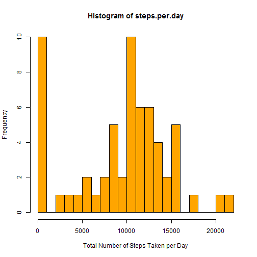
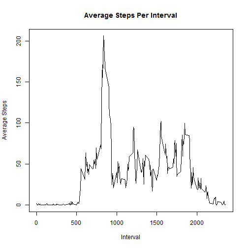
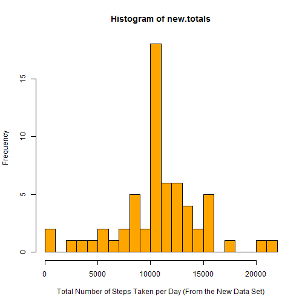
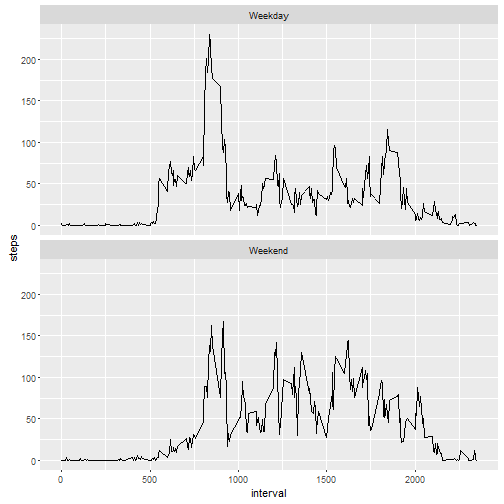

# Reproducible Research: Peer Assessment 1

## Loading and preprocessing the data
The data for this assignment were provided by the course instructor, Prof. Peng. The data are contained in a comma-separated file. Such file, in turn, is enclosed in a compressed file. Upon reviewing the file, we can identify that we are dealing with a simple data table of only 3 variables, but 17568 observations.


```r
unzip(zipfile="activity.zip")
data <- read.csv('activity.csv', header = TRUE, sep=",", colClasses=c("numeric", "character", "numeric"))
data$date <- as.Date(data$date)
names(data)
```

```
## [1] "steps"    "date"     "interval"
```

```r
str(data)
```

```
## 'data.frame':	17568 obs. of  3 variables:
##  $ steps   : num  NA NA NA NA NA NA NA NA NA NA ...
##  $ date    : Date, format: "2012-10-01" "2012-10-01" ...
##  $ interval: num  0 5 10 15 20 25 30 35 40 45 ...
```

```r
head(data)
```

```
##   steps       date interval
## 1    NA 2012-10-01        0
## 2    NA 2012-10-01        5
## 3    NA 2012-10-01       10
## 4    NA 2012-10-01       15
## 5    NA 2012-10-01       20
## 6    NA 2012-10-01       25
```

## What is the total number of steps taken per day?
This histogram displays the total number of steps taken by an individual per day. The original data exclude missing values, represented by the string "NA". These missing values are omitted from this analysis per assignment instructions.

```r
steps.per.day <- tapply(data$steps, data$date, FUN=sum, na.rm=TRUE)
hist(steps.per.day,
     breaks = 20,
     col = "orange",
     xlab = "Total Number of Steps Taken per Day")
```



```r
mean(steps.per.day)
```

```
## [1] 9354.23
```

```r
median(steps.per.day) 
```

```
## [1] 10395
```

Ignoring missing values (i.e. NAs), the average (or **mean**) number of steps taken per day is 9354.2295082.

Again, ignoring missing values (i.e. NAs), the **median** number of steps taken per day is 1.0395 &times; 10<sup>4</sup>.

## What is the average daily activity pattern?
Following is a plot of the average number of steps taken during during the intervals in a given day.

```r
steps.pattern <- aggregate(x = list(steps=data$steps), by = list(interval=data$interval),
                           FUN=mean, na.rm=TRUE)

plot(steps.pattern$interval, steps.pattern$steps,
     type="l",
     main="Average Steps Per Interval",
     xlab="Interval",
     ylab="Average Steps")
```



```r
max.steps <- steps.pattern[which.max(steps.pattern$steps),]
```

The maximum average steps per period occur at interval 835, 206.1698113.

## Imputing missing values

```r
# Number of observations
nrow(data)
```

```
## [1] 17568
```

```r
# Number of Observations without valid values
sum(is.na(data$steps))
```

```
## [1] 2304
```
The total number of observations in the data set is 17568. Of these, 2304 contain missing values (i.e. NAs) for the number of steps taken.

Observations with missing value are replaced by the average number of steps in the observations with valid values in that interval. A new data set is created to include the missing values.


```r
no.ma <- function(steps, interval) {
    new.value <- NA
    if (!is.na(steps))
        new.value <- c(steps)
    else
        new.value <- (steps.pattern[steps.pattern$interval==interval, "steps"])
    return(new.value)
}
new.data <- data
new.data$steps <- mapply(no.ma, new.data$steps, new.data$interval)
```


The following histogram represents the total number of steps per day using the missing values.


```r
new.totals <- tapply(new.data$steps, new.data$date, FUN=sum)
hist(new.totals,
     breaks=20,
     col = "orange",
     xlab = "Total Number of Steps Taken per Day (From the New Data Set)")
```



```r
mean(new.totals)
```

```
## [1] 10766.19
```

```r
median(new.totals) 
```

```
## [1] 10766.19
```

The new **mean** number of steps taken per day is 1.0766189 &times; 10<sup>4</sup>.

The new **median** number of steps taken per day's 1.0766189 &times; 10<sup>4</sup>.

## Are there differences in activity patterns between weekdays and weekends?

In order to identify any differences in activity patterns in a day of the week, one must create a new variable, in this case defined as "Day", which indicates whether a set of observations are reported for weekdays or day of the weekend.


```r
new.data$date <- as.POSIXlt(new.data$date,format="%Y-%m-%d")
new.data$day <- "Weekday"
new.data$day [weekdays(new.data$date) %in% c("Saturday","Sunday")] <- "Weekend"
```


The following couple of plots display a comparison between the weekday and weekend observations. The plots make it clear that weekdays are somewhat more productive in terms of steps taken than Saturdays and Sundays.  


```r
steps.pattern <- aggregate(steps~interval + day, data=new.data, mean)

library(ggplot2)
```

```
## Find out what's changed in ggplot2 at
## http://github.com/hadley/ggplot2/releases.
```

```r
plot <- ggplot(data = steps.pattern, aes(x=interval,y=steps)) 
plot + geom_line() + facet_wrap(~day,nrow=2)
```


